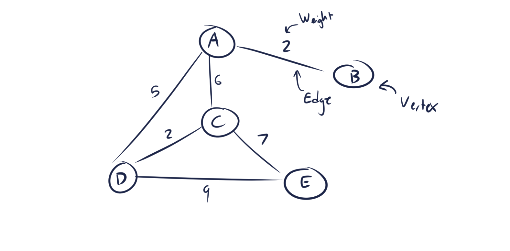

# Graph

A graph is a collection of nodes (called vertices) connected through edges, edges can have weight to them to model something like distance or resistance. There are multiple ways to implement graphs, two popular methods are adjacency lists and the adjacency matrix.

## In Memory

In memory, a graph looks like:



## Operations

A graph is capable of:

* **Add Vertex:** Add a vertex to the graph
    * Adding a vertex to the graph is O(1).
* **Add Edge:** Add an edge between vertices.
    * Adding an edge to the graph is O(1).
* **Delete Vertex:** Remove a vertex from the graph.
    * Removing a vertex is O(|V|) where '|V|' is the degree of the vertex. This is because each of the vertex's neighbors must have their pointers to the vertex changed and their edges removed.
* **Delete Edge:** Remove an edge from the graph.
    * Removal of an edge is O(1) as all that needs changing is 2 pointers (1 for each vertex it is connected to).

## Use Cases

Graphs are useful for modeling real life networks like telephone lines, pipe lines, distances between cities, etc. Because of this, graphs can help solve many problems related to finding the shortest path to a node, or minimal spanning trees.

Graphs are not useful for much else.

## Examples

```python
#Instantiation
example_graph = Graph()

#Add vertex
example_graph.addVertex('Bend')
example_graph.addVertex('Redmond')

#Add edge
example_graph.addEdge('Bend', 'Redmond')

#Remove edge
example_graph.removeEdge('Bend', 'Redmond')

#Remove vertex
example_graph.removeVertex('Bend')
```
