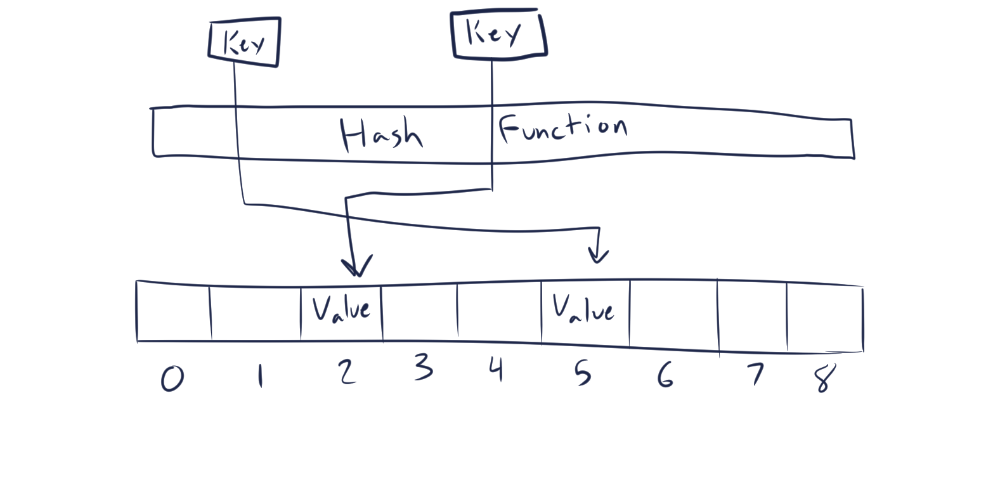

# Set

A set is an unordered collection of unique data. Unlike an array, a set is unordered and nonsequential which means sets do not allow for indexing or other sequence-like behavior.

## In Memory

In memory, a set looks like:



## Operations

A set is capable of:

* **Add:** Add an element to the set.
    * The average complexity of this operation is O(1) as sets are implemented as hash tables, adding an item to the set is constant. If the hashing function is really, really bad, then the complexity becomes O(n).
* **Remove:** Delete an element in the set.
    * Deletion is also O(1) like add, but can also degenerate to O(n).
* **In:** Check whether or not the set contains a particular item.
    * Just like add and delete, this operation is also O(1).
* **Union:** Return a new set with all elements from both sets.
    * The algorithmic complexity of this operation is a bit complicated as it is O(len(set1)+len(set2)), or the length of the first set plus the length of the second set.
* **Intersection:** Return a new set with only those elements common to both sets.
    * The complexity of this operation is O(min(len(set1), len(set2))) as the time it takes is bounded by the size of the smaller set. Since getting an element is constant, you only need to make 1 comparison for each element in the smaller list.
* **Difference:** Return a new set with all items from one set not in another set.
    * The complexity of this operation is just O(len(set1)) and is the same as intersection.

## Use Cases

Sets are useful when you don't want any duplicate elements and want to know whether or not you already have a particular value, as membership verification is instant.

Sets are not useful when you want duplicates, or sequence-like behavior that a list would provide.

## Examples

In Python:

```python
#Instantiation
example_set = {1, 2, 3, 4, 5, 6, 7}

#Adding
example_set.add(8)
example_set.add(9)

#Deleting
example_set.remove(9)

#In
print(8 in example_set)

#Union
example_set2 = {9, 10}

example_set.union(example_set2)  # set will now be {1, 2, 3, 4, 5, 6, 7, 8, 9, 10}

#Intersection
example_set3 = {4, 5, 6}

example_set.intersection(example_set3)  # set will now be {4, 5, 6}

#Difference
evens = {2, 4, 6, 8, 10}

example_set.difference(evens)  # set will now be {5}
```
