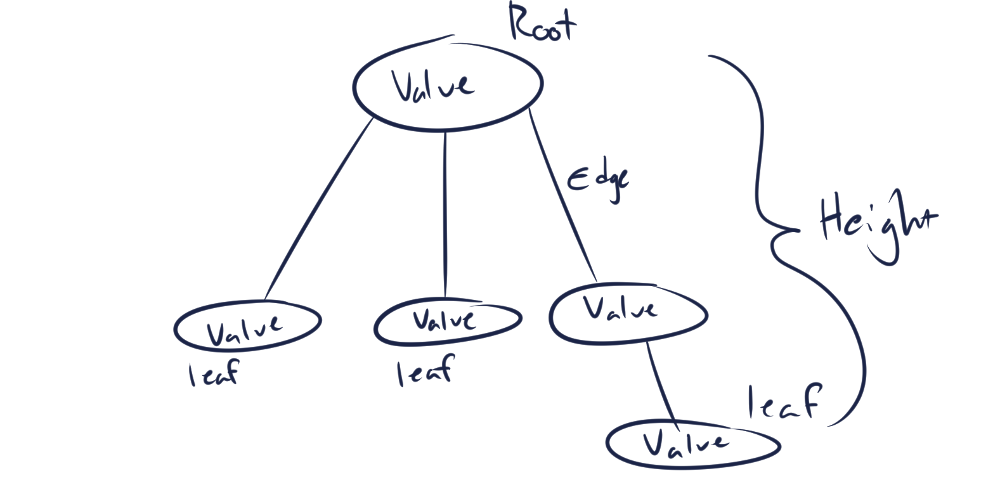
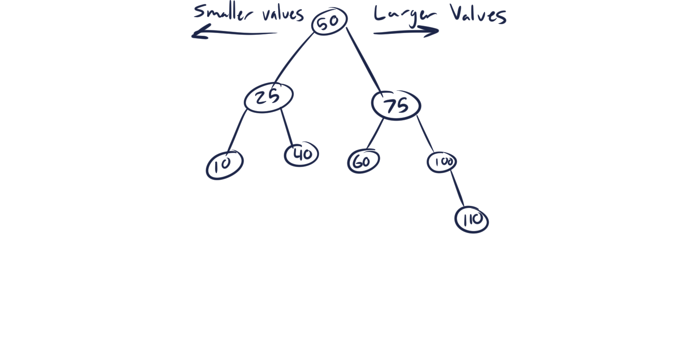
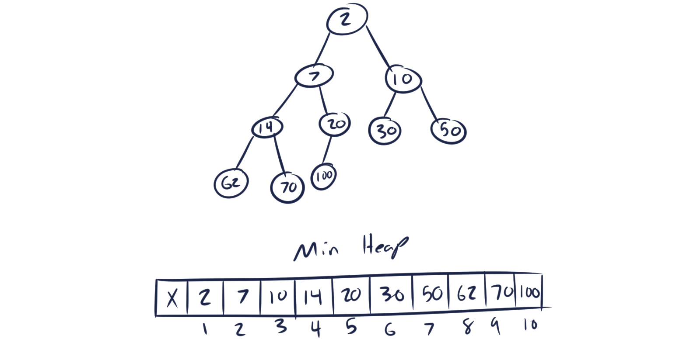

# Tree

A tree is a linear collection of nodes that point to their childen. A parent node is called a root and the nodes beneath it are called children. A node that has no children is called a leaf. Due to the high variance of types of trees, I will have seperate categories for the trees I am experienced with below.

## In Memory

In memory, a tree looks like:



# Binary Search Tree

A binary search tree is a tree inserts data based on value, smaller values are inserted on the left while larger values are inserted on the right. Since it is a binary tree, every root can only have up to two children.

## In Memory

In memory, a binary search tree looks like:



## Operations

A binary search tree is capable of:

* **Insert:** Insert a node into the tree.
    * Insertion is O(h) where 'h' is the height of the tree. In the worst case where all values end up inserted in one direction, the tree degenerates into a linked list and insertion becomes O(n).
* **Delete:** Remove a node in the tree.
    * Deletion is O(h) for the same reasons as insertion, but can become O(n).
* **Search:** Search the tree for a node, if it exists.
    * Searching is the same as insertion and deletion.
* **Traversal (Pre-order):** Print the values of the tree in pre-order (root -> left -> right).
* **Traversal (In-order):** Print the values of the tree in order (left -> root -> right).
* **Traversal (Post-order):** Print the values of the tree in post-order (left -> right -> root).
    * All traversals are O(n) where 'n' is the amount of nodes in the tree. This is because each node in the tree must be visited.

## Use Cases

A binary search tree is useful when you need to keep data sorted, as insertion is on average O(log(n)).

A binary search tree is not so useful when you don't need your data sorted and need to do lots of searching.

## Examples

In Python:

```python
#Instantiation
example_bst = BinarySearchTree(50)

#Insertion
example_bst.insert(BinarySearchTree(25))
example_bst.insert(BinarySearchTree(75))

#Search
example_bst.find(25)

#Traversals
print(example_bst.preorder())  # Prints 50, 25, 75
print(example_bst.inorder())  # Prints 25, 50, 75
print(example_bst.postorder())  # Prints 25, 75, 50

#Deletion
example_bst.delete(25)
```

# Binary Heap (Priority Queue)

A binary heap, while represented as a tree, is actually dependent on an underlying container such as an array or list. Parents find their children through a simple calculation (for left child (2 * index), for right child (2 * index + 1)). A binary heap has two variations, a min heap and a max heap. A min heap prioritizes smaller values and keeps the smallest value at the top of the heap, while a max heap keeps the largest value at the top of the heap. Since the heap is binary, each node only ever has up to two children.

## In Memory

In memory, a binary heap looks like:



## Operations

A binary heap is capable of:

* **Insert (Enqueue):** Add a new item to the heap.
    * Insertion with a binary heap is O(logn). While appending the data is instant, the act of keeping track of smallest (or largest) values is what makes the operation logarithmic. When a new item is inserted, if it is smaller than its parent, then it swaps places with its parent, and repeats this process until it either no longer has a parent or is not smaller than its parent.
* **Delete (Dequeue):** Delete an item from the heap.
    * Deletion is usually deletion of the first item in the underlying container, and has the same complexity as insertion. When this happens, the most recent item that was added to the heap becomes the new first item in the list. Once this happens, it compares itself with both children and swaps with the smaller child and repeats this process until it no longer has children or is no longer larger than its children.

## Use Cases

A binary heap is the most common way to implement a priority queue, which is a queue that prioritizes smallest (or largest) values.

## Examples

In Python:

```python
#Instantiation
example_heap = BinaryHeap()

#Insertion
example_heap.insert(10)

#Deletion
example_heap.delete(10)
```
